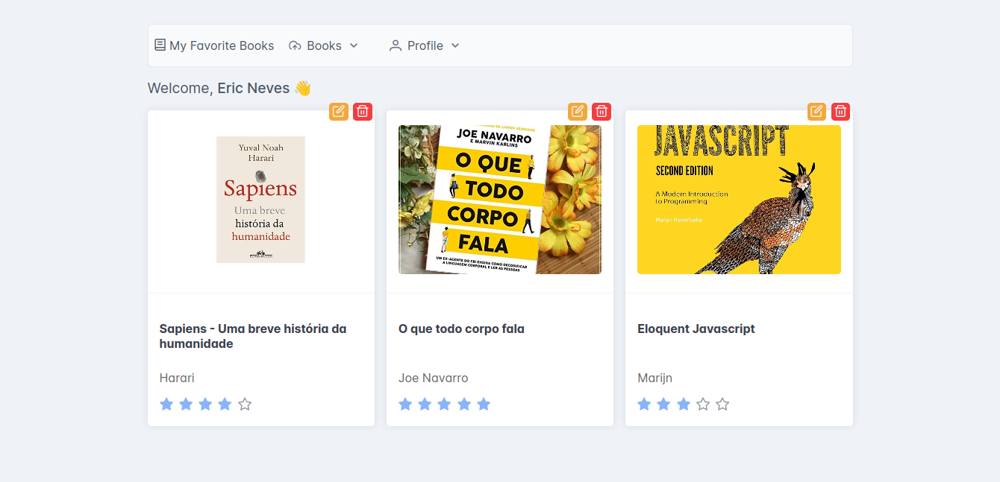

<h4 align="center">
  <br />
  
  <br />
    My Favorite Books
  <br />
</h4>

<p align="center">Aplicação desenvolvida com <strong>PHP</strong> e <strong>Angular</strong>, porém, com o foco no app em PHP que foi criado baseado nos princípios <strong>SOLID</strong> e na arquitetura <strong>package-by-feature</strong>, garantindo maior legibilidade e organização do código, bem como a implementação de <strong>testes automatizados</strong>.</p>

<p align="center">Data de criação: Jun 9, 2024</p>

<p align="center">
  
  
  
  
</p>



#### Intro 📜

A aplicação com **PHP** adota princípios de design de software, como os **princípios SOLID**, e uma arquitetura modular baseada em funcionalidades (**package-by-feature**). Essa abordagem garante que o código seja bem estruturado, fácil de entender e manter, além de permitir uma escalabilidade e extensibilidade mais simples.

> [!NOTE]
> O **upload** das imagens são relativamente simples, com **validação** e salvas no formato **BLOB** (**Binary Large Object**), num **cenário real**, seriam salvas em uma **CDN** (**Content Delivery Network**).

#### Features 💡

- 📁 Padrão Package By Feature
  - 🙍 User
    - Criar usuário
    - Autenticação - JWT
    - Informações do Usuário
    - Editar Usuário
  - 📚 Book
    - Criar livro
    - Editar livro
    - Informações de um livro
    - Todos os livros
    - Remover um livro
- ⚡ Dependencies:
  - phpunit/phpunit: `^10.5`
  - vlucas/phpdotenv: `^5.6`
  - @angular/cli: `^17.3.8`
  - primeng: `^17.18.1`,
  - and more...

#### Doc 📑

### Routes 

>
> [!NOTE]
> Para adicionar uma nova **rota**, deve-se levar em consideração os **use cases**, **controllers** e as **factories**. 
>

```
|-- routes
|   |-- api.php
|-- config
|   |-- factories.php
|-- UseCases
|   |-- Intro
|   |   |-- WelcomeMessage
|   |   |   |-- WelcomeMessageController.php
|   |   |   |-- WelcomeMessageFactory.php
|   |   |   |-- IWelcomeMessageUseCase.php
|   |   |   |-- WelcomeMessageUseCase.php
```

Em `routes/api.php`, referencie o **controller** através do **namespace**. Porém, deve-se remover o `App\UseCases\`, mantendo apenas o restante, nesse caso, `Intro\WelcomeMessage\WelcomeMessageController`.

Exemplo:

```php 

<?php 

use App\Http\Router;

Route::get('/', 'Intro\WelcomeMessage\WelcomeMessageController');

```

Agora, em `config/factories.php`, associe o **controller** passado na rota com a **factory** do **use case**.

>
> [!NOTE]
> A `factory` é responsável por criar as **instâncias** e injetar as **depedências**.
>

```php 

return [
  'Intro\WelcomeMessage\WelcomeMessageController' => App\Intro\WelcomeMessage\WelcomeMessageFactory::class
];

```

### Use Cases

De modo geral, será exemplificado a criação de um **use case** incluindo recursos como **banco de dados**.

```
|-- Providers
|   |-- IUserPostgresProvider.php
|   |-- Implementation
|   |   |-- UserPostgresProvider.php
|-- Repositories
|   |-- UserRepository.php
|-- UseCases
|   |-- User
|   |   |-- FetchUser
|   |   |   |-- FetchUserController.php
|   |   |   |-- FetchUserFactory.php
|   |   |   |-- IFetchUserUseCase.php
|   |   |   |-- FetchUserUseCase.php
```
> [!NOTE]
> `IUserPostgresProvider` será responsável por definir os contratos de consultas SQL.
> 

```php 

<?php 

namespace App\Providers;

interface IUserPostgresProvider
{
  public function fetch(int $id): array;
}

```

> [!NOTE]
> `UserPostgresProvider` será responsável pela implementação das consultas SQL (`IUserPostgresProvider`).
> No **construtor** de `UserPostgresProvider` é passado como **injeção de depedência** a classe `PDO`.
> 

```php 

<?php

namespace App\Providers\Implementations;

use App\Providers\IUserPostgresProvider;
use PDO;

class UserPostgresProvider implements IUserPostgresProvider
{
  public function __construct(private PDO $pdo)
  {
  }

  public function fetch(int $id): array 
  {
    return $this->pdo->query("...");
  }
}

```

> [!NOTE]
> `IUserRepository` será responsável por definir o contrato de persistência dos dados.
>

```php

<?php

namespace App\Repositories;

interface IUserRepository
{
  public function fetchUser(int $id): array;
}

```

> [!NOTE]
> `UserRepository` será responsável por implementar os contratos definidos por `IUserRepository`.
> No **construtor** de `UserRepository` é passado como **inversão de depedência** a interface `IUserPostgresProvider`.
> 

```php 

<?php

namespace App\Repositories\Implementations;

use App\Providers\IUserPostgresProvider;
use App\Repositories\IUserRepository;

class UserRepository implements IUserRepository
{
  public function __construct(private IUserPostgresProvider $database)
  {
  }

  public function fetchUser(int $id): array
  {
    return $this->database->fetch($id);
  }  
}

```

> [!NOTE]
> `IFetchUserUseCase` será responsável por definir o contrato do **use case**.
> 

```php 

<?php

namespace App\UseCases\User\FetchUser;

interface IFetchUserUseCase
{
  public function execute(int $userId): array;
}

```

> [!NOTE]
> `FetchUserUseCase` será responsável por implementar `IFetchUserUseCase`, bem como as regras de negócio e nesse caso realizar operações através do **repository**.
> No **construtor** de `FetchUserUseCase` é passado como **inversão de depedência** o `IUserRepository`.
> 

```php 

<?php

namespace App\UseCases\User\FetchUser;

use App\Repositories\IUserRepository;
use App\UseCases\User\FetchUser\IFetchUserUseCase;
use Exception;

class FetchUserUseCase implements IFetchUserUseCase
{
  public function __construct(private IUserRepository $userRepository)
  {
  }

  public function execute(int $userId): array
  {
    $user = $this->userRepository->fetchUser($userId);

    if (!$user) {
      throw new Exception('Sorry, user not found.');
    }

    return $user;
  }
}


```

> [!NOTE]
> No construtor do **controller** é passado como **inversão de depedência** a interface `IFetchUserUseCase`.

```php

<?php

namespace App\UseCases\User\FetchUser;

use App\Http\Request;
use App\Http\Response;
use App\UseCases\User\FetchUser\IFetchUserUseCase;

class FetchUserController
{
  public function __construct(private IFetchUserUseCase $fetchUserUseCase)
  {
  }

  public function handle(Request $request, Response $response): Response
  {
    return $response->json([
      "data" => $this->fetchUserUseCase->execute($request->user()->id),
    ]);
  }
}


```

> [!NOTE]
> Por último deve-se passar as implementações dos contratos na **factory** do **use case**.
> 

```php 

<?php

namespace App\UseCases\User\FetchUser;

use App\Infrastructure\Postgres;
use App\Providers\Implementations\UserPostgresProvider;
use App\Repositories\Implementations\UserRepository;
use App\UseCases\User\FetchUser\FetchUserController;
use App\UseCases\User\FetchUser\FetchUserUseCase;

class FetchUserFactory
{
    public function generateInstance(array $databaseConfig): FetchUserController
    {
        $postgres            = new Postgres();
        $postgresProvider    = new UserPostgresProvider($postgres::connect($databaseConfig));
        $userRepository      = new UserRepository($postgresProvider);
        $fetchUserUseCase    = new FetchUserUseCase($userRepository);
        $fetchUserController = new FetchUserController($fetchUserUseCase);

        return $fetchUserController;
    }
}


```

### Middlewares

Para adicionar um novo **middleware** segue-se o exemplo abaixo:

```
|-- middlewares
|   |-- NewMiddleware.php
```

```php 

<?php

namespace App\Middlewares;

use App\Http\JWT;
use App\Http\Request;
use App\Http\Response;

class NewMiddleware
{
    public function handle(Request $request, Response $respose)
    {
        $a = 1;
        $b = 2;

        if ($a !== $b) {
          return $respose->json(['message' => 'Unauthorized'], 401);
        }
    }
}

```

O próximo passado será associar o **middleware** com uma **chave única** em `config/middlewares.php`.

```php 

<?php 

return [
  'auth'  => App\Middlewares\EnsureAuthenticatedMiddleware::class,
  'equal' => App\Middlewares\NewMiddleware::class,
]

```

Por último é só usar o **middleware** na **rota**.

```php 

Router::get('/users/fetch', 'User\FetchUser\FetchUserController')->middlewares('auth', 'equal');

```

#### Execution ⚙️

>
> [!NOTE]
> Siga os passos abaixo para a execução do projeto em **ambiente de desenvolvimento**.

O primeiro passo, é renomear o arquivo `.env.example` para `.env`, o mesmo se encontra em `/www`.

```sh 

# Install deps www/
$ cd www && composer install

# Install deps web/
$ cd web && pnpm install

# Docker
$ docker compose -f "docker-compose-dev.yml" up -d --build

# Tests
$ cd www && composer test

```

#### Author 🦆

<table>
  <tr>
    <td align="center">
      <a href="https://www.instagram.com/ericneves_dev/">
        
        <br />
        <sub>
          <b>Eric Neves</b>
        </sub>
      </a>
    </td>
  </tr>
  <tr>
    <td>
      <a href="https://www.instagram.com/ericneves_dev/">
        
      </a> 
      <br />
      <a href="https://linkedin.com/in/ericnevesrr"> 
        
      </a>
    </td>
  </tr>
</table>

#### License 📋


